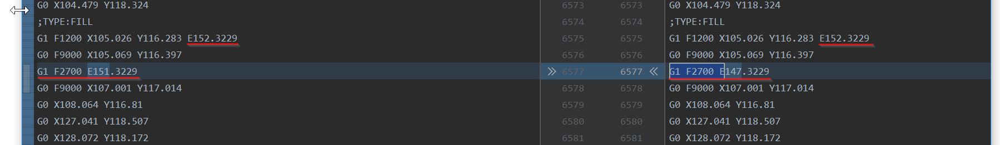

# gcode Retraction Changer
Changes retraction distance and speed from a specific layer gradually, because Cura is unable to do so.
The goal is to save material during stringing tets by doing only a single test.

The STL file I've used for the custom script:
https://www.thingiverse.com/thing:2450004

Tested only on Ender 3 and Cura 4.6.1 with my own understanding of `gcode` syntax.

# Prerequisites
Make sure you calibrate your extruder by following one of these tutorials!

https://www.youtube.com/watch?v=xzQjtWhg9VE

https://www.youtube.com/watch?v=3yIebnVjADM

# Running the code
Changing retraction distance, starting with 0 with one step in every 25 layer
```shell script
python ./main.py -f GCODE_FILE_NAME -m distance -l 25 -d 0
```

Changing retraction speed from 25mm/s by 5mm/s in every 25 layer
```shell script
python ./main.py -f GCODE_FILE_NAME -m speed -l 25 -s 1500 -t 300
```

Specify the layer height you would like to use for changing the retraction distance in the second parameter.
For instance of you use 0.2 layer height setting the value to 25 will result as retraction setting change in every 25 * 0.2 = 5mm

Specify the initial retraction value. To start with no retraction at all, set this to 0.

# Results
The modified `.gcode` file will be named as `GCODE_FILE_NAME.gcode.mod`. Make sure you compare this with the original.
Also, make sure you're observing the printer all the time during the execution!
I TAKE ABSOLUTELY NO WARRANTY FOR RUINING YOUR PRINTER!

# Example
Let's say I want to do a test with the initial retraction distance of 0 and chagne it on every 5mm.
My layer height is 0.2, so I run the following command:
```shell script
python main.py -f tests/CE3_stringing.gcode -m distance -l 25 -d 0
```

The script will log out every retraction modification, where it was identifiable in the `.gcode` file.
In my case this was the following:

```shell script
...
LAYER: 33
RETRACT: 132.03252 changed to 136.03252 with retraction distance 1mm in G1 F2700 E132.03252
 at layer 33
RETRACT: 132.66489 changed to 136.66489 with retraction distance 1mm in G1 F2700 E132.66489
 at layer 33
LAYER: 34
RETRACT: 133.36921 changed to 137.36921 with retraction distance 1mm in G1 F2700 E133.36921
 at layer 34
RETRACT: 134.00157 changed to 138.00157 with retraction distance 1mm in G1 F2700 E134.00157
 at layer 34
LAYER: 35
RETRACT: 134.71042 changed to 138.71042 with retraction distance 1mm in G1 F2700 E134.71042
 at layer 35
RETRACT: 135.34281 changed to 139.34281 with retraction distance 1mm in G1 F2700 E135.34281
 at layer 35
LAYER: 36
...
```

The goal is to change every line that looks like the example below.
These are the lines I've identified as retraction commands in the `.gcode`



# gcode In Action
After running the `.gcode` file in my Ender 3 I realized that the ideal setting is either 2 or 3mm within just 15 minutes!!!


